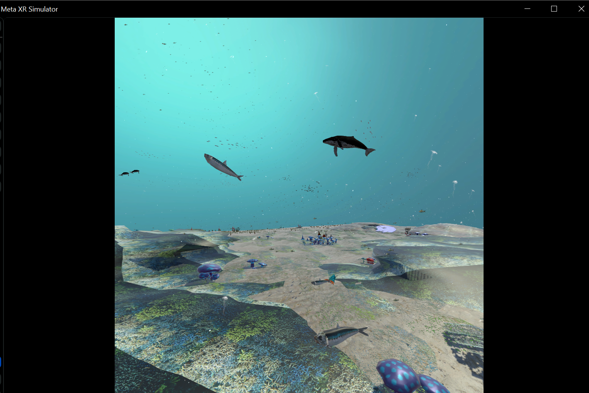

# VR-Ocean : Simulation d'Écosystème Sous-Marin 🌊



VR-Ocean est une expérience de réalité virtuelle immersive développée avec Unity, mettant en scène un écosystème marin dynamique. L'utilisateur est plongé dans les profondeurs de l'océan pour observer la vie marine dans un environnement apaisant et réaliste.

##  Fonctionnalités Principales

- **Vie Marine Dynamique** : Observation de bancs de sardines, de baleines majestueuses et d'autres créatures marines.
- **Système de Boids** : Simulation de comportements de groupe réalistes (notamment pour les sardines).
- **Environnement Immersif** : Végétation sous-marine animée, effets de lumière (caustiques) et particules pour une immersion totale.
- **Compatible XR** : Conçu pour les casques de réalité virtuelle via l'intégration Meta XR.

##  Stack Technique

- **Moteur** : Unity 2022.3.22f1
- **Langage** : C#
- **SDK VR** : Meta XR Interaction SDK
- **Gestion des Fichiers** : Git LFS (Large File Storage) pour les textures et modèles haute résolution.

##  Installation & Utilisation

### Prérequis
- Unity 2022.3.22f1 ou supérieur.
- [Git LFS](https://git-lfs.github.com/) installé sur votre machine.

### Récupération du Projet
1. Clonez le dépôt :
   ```bash
   git clone https://github.com/Meryemeilla/VR-Ocean.git
   ```
2. **Important** : Téléchargez les fichiers volumineux (textures/modèles) :
   ```bash
   git lfs pull
   ```
3. Ouvrez le dossier avec Unity Hub.

##  Structure du Projet

- `Assets/_Project` : Contient les scripts, scènes et assets personnalisés.
- `Assets/Art` : Contient les modèles 3D, textures et animations.
- `ProjectSettings` : Configurations spécifiques du projet Unity.


